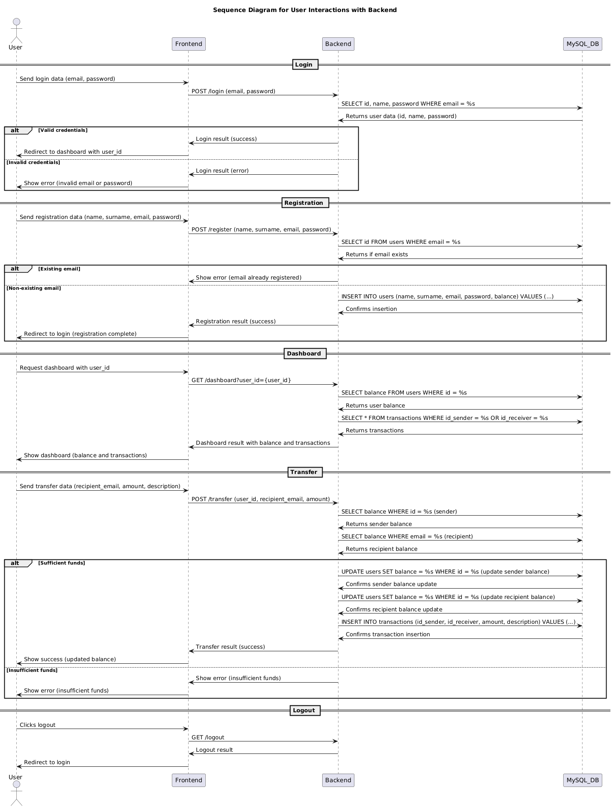
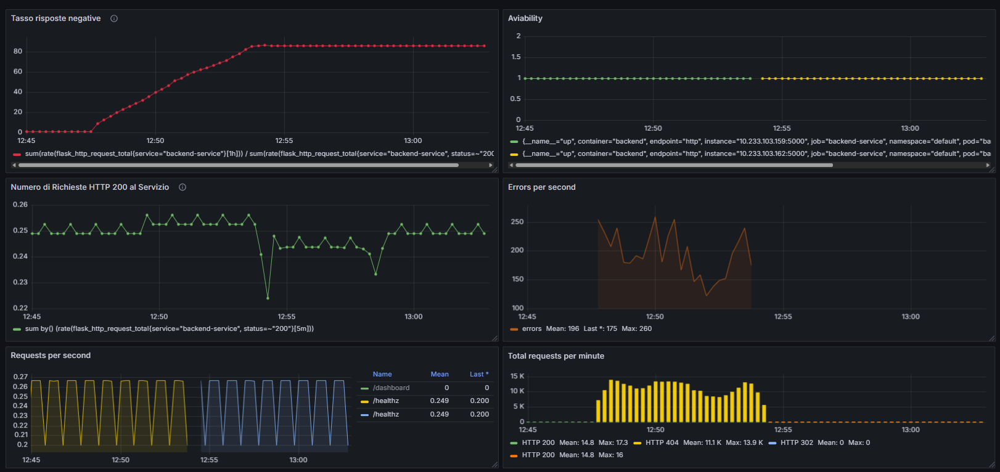
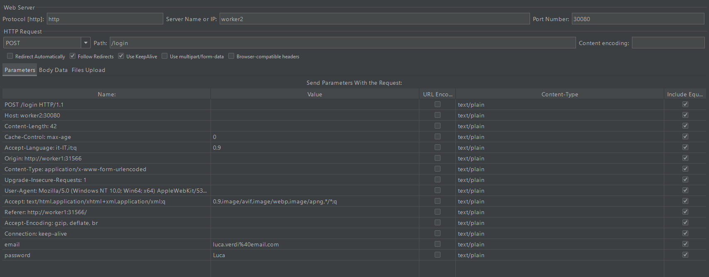
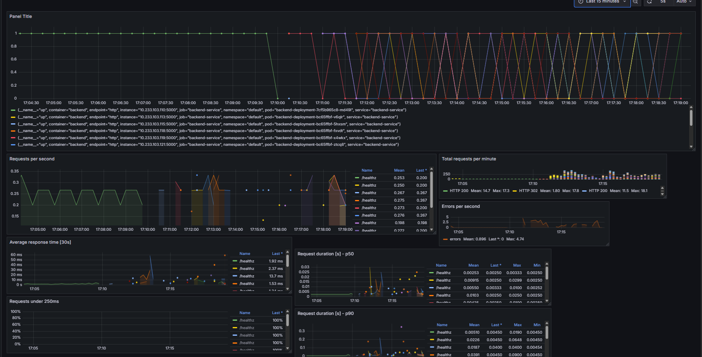

**Autori:**
Giovanni Gentile
Umberto Elias De Angelis

---

## Introduzione

Il progetto si concentra sulla realizzazione di un ambiente di test controllato per lo studio e la valutazione delle tecniche di Moving Target Defense (MTD) in contesti dinamici. Data la crescente adozione di architetture basate su container e orchestratori come Kubernetes, l'ambiente è stato implementato su un cluster Kubernetes per esplorare le sfide e le opportunità che tali piattaforme offrono per l'MTD. Per fornire un bersaglio realistico per la simulazione di attacchi e la successiva applicazione di strategie di difesa, è stata sviluppata un'applicazione web che replica le funzionalità essenziali di una piattaforma bancaria online. Questo documento descrive in dettaglio la configurazione dell'infrastruttura di test, l'architettura dell'applicazione bancaria e le sue logiche operative, i requisiti di sicurezza considerati e un'analisi preliminare dei potenziali vettori di attacco identificati.

## Setup dell'Infrastruttura

L'ambiente di test è stato realizzato utilizzando tre macchine virtuali (VM) ospitate su VMware. Ogni VM esegue Ubuntu Server ed è configurata con connessione di rete in modalità bridged, permettendo una facile raggiungibilità tra i nodi e dall'esterno.

La distribuzione dei ruoli e le specifiche hardware delle VM sono le seguenti:

* **Master Node:** 4 GB di RAM, 2 Processori virtuali, 40 GB di spazio su disco. Questo nodo ospita i componenti del Control Plane di Kubernetes.
* **Worker Node 1 (Worker1):** 8 GB di RAM, 4 Processori virtuali, 30 GB di spazio su disco. Questo nodo è dedicato all'esecuzione di specifici workload applicativi.
* **Worker Node 2 (Worker2):** 8 GB di RAM, 4 Processori virtuali, 30 GB di spazio su disco. Anche questo nodo è dedicato all'esecuzione di specifici workload applicativi.

Sul cluster è stata installata la versione **v1.23.10 di Kubernetes**, e come piattaforma di gestione e UI è stato utilizzato **KubeSphere nella versione v3.4.1**. KubeSphere fornisce un'interfaccia utente semplificata e funzionalità aggiuntive che facilitano la gestione del cluster e il deployment delle applicazioni.

## Architettura dell'Applicazione Bancaria di Test

L'applicazione bancaria di test è stata progettata con un'architettura a microservizi semplificata, composta da tre componenti principali:

* **Frontend:** L'interfaccia utente web a cui accedono gli utenti. È sviluppato con tecnologie web standard (HTML, CSS, JavaScript).
* **Backend:** Il servizio applicativo che gestisce la logica di business, le operazioni dell'utente (login, registrazione, trasferimenti, etc.) e l'interazione con il database. È implementato utilizzando il framework Python Flask.
* **Database:** Un'istanza MySQL utilizzata per memorizzare i dati degli utenti (credenziali, saldo) e le transazioni.

La sequenza di interazione tipica per un'operazione utente (come la visualizzazione della dashboard o un trasferimento) segue il flusso logico: Utente (via Frontend) -> Backend -> Database -> Backend -> Frontend (aggiornamento pagina).
## Implementazione nel Cluster Kubernetes

Per sfruttare il potenziale dell'ambiente distribuito e creare un target interessante per le strategie MTD, i componenti dell'applicazione sono stati intenzionalmente dislocati su nodi worker specifici del cluster utilizzando le funzionalità di scheduling di Kubernetes:

* I pod relativi al servizio **Frontend** e al servizio **Database MySQL** sono stati configurati per essere schedulati sul **Worker Node 1 (Worker1)**. Per il Frontend, questo è stato ottenuto tramite nodeAffinity (come visibile nel deployment YAML).
* I pod relativi al servizio **Backend** (Flask) sono stati configurati per essere schedulati sul **Worker Node 2 (Worker2)**. Questo è stato ottenuto tramite nodeSelector (come visibile nel deployment YAML).

Questa distribuzione forzata su nodi diversi crea un'interazione "cross-node" che è rilevante per i test MTD.

La comunicazione tra i servizi è gestita tramite i Service di Kubernetes. Il backend è configurato per connettersi al database MySQL utilizzando il nome del Service associato al deployment MySQL (es. mysql-service), un approccio standard in Kubernetes.

Un dettaglio importante dell'implementazione del frontend (visibile nel codice JavaScript fornito) è che le chiamate al backend non avvengono tramite il nome del Service interno del backend (backend-service), ma bensì puntano direttamente all'indirizzo del nodo worker2 sulla NodePort esposta dal Service del backend (porta 30080). Questo comportamento rende il backend direttamente accessibile dall'esterno sulla porta 30080 di ogni nodo del cluster e vincola il funzionamento del frontend a conoscere l'indirizzo IP del nodo specifico dove è esposto il backend tramite NodePort, il che è un elemento da considerare per la resilienza e per i test di sicurezza.

Sia il Service del frontend che quello del backend sono esposti esternamente tramite NodePort (31566 per il frontend e 30080 per il backend), rendendo l'applicazione accessibile dall'esterno del cluster sull'indirizzo IP di qualsiasi nodo worker.

La configurazione del backend prevede l'utilizzo di Kubernetes Secrets per la gestione sicura delle credenziali del database e altre chiavi sensibili, un'ottima pratica di sicurezza. Inoltre, sono stati configurati i probe di readiness e liveness per monitorare lo stato di salute del pod del backend. È stata anche iniziata la configurazione per il monitoring tramite Prometheus, definendo un ServiceMonitor per il backend, che prevede la raccolta di metriche dall'endpoint /metrics sulla porta 5000 del pod di backend.

## Requisiti e Controlli di Sicurezza Implementati

Durante lo sviluppo dell'applicazione bancaria di test, sono stati considerati e implementati alcuni requisiti di sicurezza basandosi su controlli standard, facendo riferimento, ad esempio, ai controlli di sicurezza delineati dal NIST. Le tabelle seguenti riassumono i principali requisiti implementati per ciascun endpoint del backend e gli aspetti trasversali, insieme ai controlli NIST correlati e una descrizione dell'implementazione specifica.

### Login Endpoint

| Requisito                         | Controllo NIST | Descrizione del Controllo                                          | Implementazione                                                                   |
| :-------------------------------- | :------------- | :----------------------------------------------------------------- | :-------------------------------------------------------------------------------- |
| Autenticazione con hash password  | IA-5           | Gestione sicura degli autenticatori (es. hashing delle password).  | Usa "check_password_hash" e "generate_password_hash" (Werkzeug).                  |
| Validazione formato email         | SI-10          | Validazione dell'input per prevenire dati malformati o dannosi.    | Regex "EMAIL_REGEX" per verificare il formato dell'email.                       |
| Generazione token JWT             | IA-2           | Identificazione e autenticazione degli utenti tramite token sicuri. | Token firmati con "itsdangerous.URLSafeSerializer".                               |
| Gestione errori sicura            | SI-10          | Gestione degli errori senza esporre informazioni sensibili.        | Redirect con parametri codificati.                                                |

### Register Endpoint

| Requisito              | Controllo NIST | Descrizione del Controllo                                     | Implementazione                                                        |
| :--------------------- | :------------- | :------------------------------------------------------------ | :--------------------------------------------------------------------- |
| Hash password          | IA-5           | Archiviazione sicura delle password tramite funzioni di hashing. | Usa "generate_password_hash" per crittografare le password.            |
| Validazione email      | SI-10          | Validazione dell'input per prevenire inserimento di email non valide. | Regex "EMAIL_REGEX" per controllo del formato.                       |
| Controllo duplicati email | AC-2           | Gestione degli account per evitare registrazioni duplicate.  | Query SQL per verificare l'esistenza dell'email nel database.          |

### Dashboard Endpoint

| Requisito                | Controllo NIST | Descrizione del Controllo                                              | Implementazione                                                        |
| :----------------------- | :------------- | :--------------------------------------------------------------------- | :--------------------------------------------------------------------- |
| Validazione token        | AC-3           | Limitazione dell'accesso ai soli utenti autorizzati.                   | Verifica del token tramite "validate_token" prima di restituire i dati. |
| Protezione dati sensibili | SC-28          | Protezione dei dati sensibili durante l'archiviazione/trasmissione.    | Conversione di Decimal a float per evitare errori di serializzazione.    |

### Transfer Endpoint

| Requisito                   | Controllo NIST | Descrizione del Controllo                                               | Implementazione                                                                 |
| :-------------------------- | :------------- | :---------------------------------------------------------------------- | :------------------------------------------------------------------------------ |
| Autorizzazione tramite token | AC-6           | Limitazione delle operazioni alle sole azioni autorizzate.              | Verifica della corrispondenza tra "user_id" nel token e nel form.               |
| Transazioni atomiche        | SC-24          | Gestione transazionale per garantire integrità dei dati.                 | Uso di "COMMIT" e "ROLLBACK" per transazioni atomiche.                          |
| Controllo saldo             | AC-4           | Controllo del flusso di informazioni per prevenire operazioni non autorizzate. | Query SQL per verificare il saldo prima dell'operazione.                        |

### Logout Endpoint

| Requisito          | Controllo NIST | Descrizione del Controllo                          | Implementazione                                                              |
| :----------------- | :------------- | :------------------------------------------------- | :--------------------------------------------------------------------------- |
| Invalidation token | AC-12          | Terminazione sicura delle sessioni utente.         | Rigenerazione della chiave segreta ("token_serializer"), ma i token precedenti non sono revocati. |

### Aspetti Trasversali

| Requisito                             | Controllo NIST | Descrizione del Controllo                                                 | Implementazione                                                                                    |
| :------------------------------------ | :------------- | :------------------------------------------------------------------------ | :------------------------------------------------------------------------------------------------- |
| CORS ristretto                        | SC-7           | Limitazione delle origini consentite per prevenire attacchi cross-domain. | Configurazione CORS con origini limitate a "http://worker1:31566".                                 |
| Prepared statements                   | SI-10          | Prevenzione SQL injection tramite query parametrizzate.                   | Uso di "cursor.execute" con parametri separati ("%s").                                             |
| Logging errori backend                | AU-3           | Registrazione degli errori per analisi forense.                           | Logging degli errori tramite "app.logger.error".                                                   |
| Validazione input avanzata (XSS/SQLi) | SI-10          | Sanitizzazione degli input per prevenire XSS e injection.                 | Sanitizzazione base con "sanitize_string", ma campi come description non sono validati contro XSS. |

## Logica Applicativa: Diagramma di Sequenza

Per illustrare in modo chiaro il flusso operativo dell'applicazione e le interazioni tra i suoi componenti, è stato realizzato un diagramma di sequenza.



Il diagramma dettaglio le sequenze di messaggi scambiati tra l'Utente (interagendo con il Frontend), il Backend e il Database MySQL per le operazioni principali:

* **Login:** Processo di autenticazione dell'utente.
* **Registrazione:** Creazione di un nuovo account utente.
* **Dashboard:** Richiesta e visualizzazione del saldo e della lista delle transazioni.
* **Trasferimento:** Esecuzione di un trasferimento fondi tra utenti, includendo le verifiche sul saldo sufficiente e gli aggiornamenti nel database.
* **Logout:** Terminazione della sessione utente.

Questo diagramma è fondamentale per comprendere il comportamento atteso dell'applicazione e per identificare i potenziali punti di attacco sui quali focalizzare i test e le strategie MTD.

## Analisi dei Potenziali Attacchi

Un passaggio cruciale nella preparazione dell'ambiente per i test MTD è l'identificazione dei potenziali vettori di attacco. È stata condotta un'analisi preliminare per mappare le vulnerabilità praticabili o teoriche legate a ciascun componente della piattaforma bancaria e all'infrastruttura sottostante, valutandone l'impatto potenziale e collegandole a metriche rilevanti per la valutazione della difesa.

### Frontend (Interfacce Web e Richieste API)

Il componente Frontend, essendo direttamente accessibile dall'utente, presenta diverse superfici di attacco. Vulnerabilità comuni includono Phishing/Page Spoofing, Cross-Site Scripting (XSS) dovuto a potenziale mancata sanitizzazione dell'input nei campi visibili, e Session Hijacking/Token Leak, aggravato nel nostro caso dall'esposizione del token nella URL. La Manipolazione Client-Side del codice JavaScript è un altro rischio. La gestione delle richieste API verso il Backend presenta rischi come CORS Bypass e il già citato Token Leak.

### Backend (Flask API)

Il Backend è il cuore della logica applicativa e, pertanto, un bersaglio primario. Gli endpoint di Login e Registrazione sono suscettibili a Credential Stuffing/Brute Force (se non mitigate), SQL Injection (se non correttamente parametrizzate, anche se sono stati usati prepared statements) e vulnerabilità legate all'enumerazione di utenti tramite timing o messaggi di errore. L'endpoint di Trasferimento è particolarmente sensibile, con rischi di CSRF (se non implementate protezioni specifiche), ID Spoofing, Race Condition e problematiche legate alla validazione dei campi numerici o del destinatario (Negative Transfer/Transfer Self). L'endpoint Dashboard presenta rischi di Token Forgery/Replay e Insufficient Authentication Check. Aspetti trasversali di sicurezza del backend come il Logging possono esporre dati sensibili se non gestiti correttamente.

### Database (MySQL)

Il Database è l'asset più critico per l'integrità e la confidenzialità dei dati. Vulnerabilità dirette includono la possibilità di Brute Force sugli hash delle password (se deboli) e, soprattutto, attacchi di SQL Injection che mirano a compromettere l'intero database. La manipolazione diretta dei dati nelle tabelle, come il Log Tampering nella tabella delle transazioni o la Data Injection tramite campi non validati, rappresenta una minaccia significativa all'integrità.

### Infrastruttura / Kubernetes

Anche l'infrastruttura sottostante e la gestione di Kubernetes presentano vettori d'attacco. A livello di Pod e Risorse, l'esposizione di Secrets o la prevedibilità dello scheduling dei pod tramite nodeAffinity/nodeSelector sono rischi. Attacchi di Resource Exhaustion possono impattare la disponibilità. Il Networking è un punto critico; l'accesso diretto via NodePort espone i servizi, la mancanza di cifratura del traffico (come TLS/SSL) rende possibile attacchi Man-in-the-Middle (MitM), e un Port Scanning inter-Pod potrebbe rivelare servizi interni esposti. Infine, la gestione dei Persistent Volumes (PV) e Persistent Volume Claims (PVC) deve essere sicura per evitare Data Persistence compromessa o accesso non autorizzato ai dati persistenti da altri pod.

### Simulazione di attacco a Pod
Come primo caso di studio, abbiamo simulato un attacco Denial-of-Service (DoS) mirato direttamente a un singolo pod del backend. Sebbene i Service di Kubernetes e il bilanciamento del carico interno (anche quello gestito da KubeSphere) rendano un attacco diretto a un singolo pod dall'esterno o da altri pod interni più complesso in scenari reali con repliche multiple, abbiamo scelto questo approccio mirato per isolare e osservare l'impatto specifico su un'unità di deployment. La metodologia dell'attacco ha utilizzato lo strumento di benchmarking per web server **ApacheBench (ab)**, eseguito con il seguente comando:

```bash
timeout 3600 ab -n 1000000 -c 100 http://<IP>:<PORT>/
```
Questo comando instruisce ApacheBench (`ab`) a inviare un totale di 1 milione di richieste (`-n 1000000`) con un livello di concorrenza di 100 richieste in parallelo (`-c 100`) verso uno specifico URL (`http://<IP>:<PORT>/`), che nel nostro caso era l'indirizzo IP interno e la porta di un pod backend isolato. L'esecuzione del comando era limitata a un massimo di 3600 secondi (`timeout 3600`).

Monitorando le dashboard di **Grafana** in tempo reale mostra un esempio delle metriche catturate), abbiamo potuto osservare gli effetti dell'attacco. Il pod preso di mira ha rapidamente mostrato un elevato carico e segni di instabilità, portando al suo riavvio automatico da parte del meccanismo di gestione dei pod di Kubernetes (probabilmente a causa del fallimento dei liveness o readiness probe, o per superamento dei limiti di risorse se configurati). I grafici, in particolare quelli relativi alla disponibilità e al numero di richieste gestite, hanno mostrato un'interruzione nel servizio fornito da quel pod specifico a partire da circa 12:45.



In risposta a questa anomalia e dopo aver monitorato l'impatto dell'attacco sulle metriche, abbiamo attivato manualmente una strategia MTD basata sull'**IP-Shuffling**. In questo contesto, l'IP-Shuffling è stato realizzato sfruttando la capacità di Kubernetes di sostituire dinamicamente i pod. L'azione è consistita nell'eliminazione forzata del pod sotto attacco. A seguito dell'eliminazione, il Deployment Controller ha automaticamente creato un nuovo pod backend per mantenere il numero di repliche desiderato. Il punto chiave è che questo nuovo pod è stato avviato con un **nuovo indirizzo IP interno** diverso da quello del pod precedente.

L'effetto di questa strategia di difesa è stato immediatamente visibile nei grafici di Grafana. Dopo un breve periodo di transizione dovuto al riavvio del pod (circa 15 secondi, come osservato dai grafici che mostrano l'attività riprendere intorno alle 13:00), le richieste hanno ricominciato a essere gestite normalmente dal nuovo pod. Questo ha dimostrato come l'attacco, che era indirizzato all'IP specifico del vecchio pod, abbia perso il suo bersaglio efficace non appena il pod è stato sostituito con uno nuovo avente un IP differente.

Questo test ha confermato che l'MTD basata sullo spostamento del bersaglio, anche in una forma semplice come il riavvio di un pod (che ne cambia l'IP), può mitigare attacchi che dipendono dalla persistenza su un indirizzo di rete specifico. È importante notare che il riavvio di un pod comporta la chiusura delle connessioni attive ad esso. Inoltre, il bilanciamento del carico interno di Kubernetes/KubeSphere contribuisce già a distribuire il traffico tra i pod sani di un Service, rendendo più difficile per un attaccante interno saturare un singolo pod senza puntare direttamente al suo IP. Il setup di monitoring con Grafana si è rivelato indispensabile per visualizzare l'impatto preciso dell'attacco, il "black-out" temporaneo e il ripristino del servizio da parte del nuovo pod difeso. Le metriche raccolte potrebbero, in un'implementazione più avanzata, essere utilizzate per attivare in modo automatico risposte MTD quando vengono superate certe soglie di allerta.

### Simulazione di Attacco DDoS al Servizio con JMeter e Limiti della Difesa Basata sulle Repliche

Come ulteriore test, abbiamo condotto una simulazione di attacco Distributed Denial-of-Service (DDoS) di maggiore intensità utilizzando lo strumento **JMeter**. L'obiettivo era generare un volume di traffico massiccio mirato direttamente al **Service** del backend, sfruttando la sua esposizione esterna tramite NodePort, per valutarne la resilienza sotto carico estremo. La richiesta HTTP specifica utilizzata per questo test era la seguente:



La configurazione del **Thread Group** di JMeter è stata definita per simulare un carico significativo di utenti concorrenti:

- **ThreadGroup.num_threads:** 100 utenti virtuali concorrenti.
- **ThreadGroup.ramp_time:** 25 secondi per avviare gradualmente tutti i 100 utenti.
- **ThreadGroup.duration:** 500 secondi di durata totale del test.
- **ThreadGroup.scheduler:** true (per rispettare la durata totale).
- **LoopController.loops:** -1 (loop infinito, effettivo per la durata totale).
- **on_sample_error:** continue (il test prosegue anche in caso di errori nelle singole richieste).

Sotto il carico generato da JMeter, il servizio backend è rapidamente diventato saturo e non responsivo. Per contrastare questo attacco DDoS, abbiamo tentato di implementare una strategia di difesa basata sull'**aumento del numero di repliche** del deployment del backend, scalando orizzontalmente il numero di pod da 1 fino a 10 e successivamente a 20 repliche.

Monitorando le dashboard di **Grafana** durante l'attacco (vedere l'immagine qui sotto, dove i diversi colori indicano le metriche per le diverse repliche dei pod del backend-service), abbiamo osservato come, nonostante l'incremento delle istanze, il servizio continuasse a manifestare problemi di disponibilità e fosse impossibile stabilire connessioni funzionali.



Riteniamo che la limitata efficacia di questa difesa, in contrasto con il successo dell'IP-Shuffling nel test precedente, sia dovuta principalmente alla natura dell'attacco che mirava al Service nel suo complesso piuttosto che a un singolo pod specifico, e ai limiti delle risorse computazionali disponibili nel nostro ambiente di test. Un attacco DDoS di questa portata satura la capacità aggregata di elaborazione e risposta del servizio. Sebbene l'aggiunta di repliche distribuisca il carico, ogni replica richiede risorse; se le risorse totali sui nodi worker sono insufficienti a sostenere un carico così elevato anche con molte istanze, lo scaling da solo non basta. È probabile che per mitigare efficacemente un attacco DDoS di questa intensità sarebbe necessario un numero significativamente maggiore di repliche supportato da un'infrastruttura con risorse hardware notevolmente superiori a quelle del nostro setup di test.

Questa simulazione ha messo in evidenza i limiti delle strategie MTD basate sul semplice scaling orizzontale contro attacchi volumetrici ampi e l'importanza del dimensionamento dell'infrastruttura. Suggeriamo che modificare la comunicazione del frontend per utilizzare il nome del Service (`backend-service`) anziché puntare direttamente all'IP del nodo (`worker2:30080`), come osservato nel codice JavaScript iniziale, potrebbe interagire in modo diverso con il bilanciamento del carico interno di Kubernetes. In uno scenario in cui il traffico è bilanciato a livello di Service ClusterIP (accessibile internamente) o un Ingress ben configurato, l'impatto dell'attacco DDoS e l'efficacia dello scaling delle repliche potrebbero variare rispetto a un attacco che colpisce direttamente la NodePort. Questa modifica potrebbe migliorare la resilienza sfruttando appieno i meccanismi di astrazione e bilanciamento di Kubernetes.

È stato descritto l'ambiente di test basato su un cluster Kubernetes e un'applicazione bancaria distribuita implementati per supportare attività di ricerca sulla Moving Target Defense. L'infrastruttura su VM e la specifica distribuzione dei componenti applicativi su nodi distinti sono stati configurati per creare uno scenario pertinente per i test. È stata illustrata l'architettura dell'applicazione, i requisiti di sicurezza considerati e implementati per i suoi endpoint, e il flusso operativo tramite diagramma di sequenza. L'analisi preliminare dei potenziali attacchi fornisce una base per la successiva fase di sperimentazione delle tecniche MTD volte a mitigare i rischi identificati.
